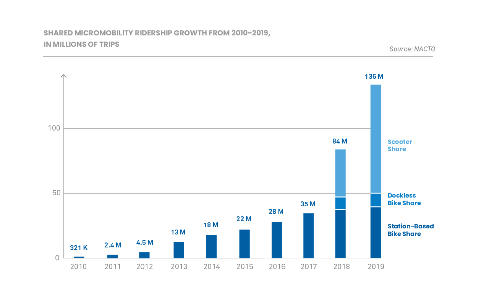

# NYC Citi Bike Analysis 
This is a summary of the analytic work that I did with the NYC Citi Bike data.

## Statistics

Bike share in the U.S. has continued its dynamic growth over the past three years, with 35 million trips taken in 2017, 25% more than in 2016. 
In 2018 people took more than twice as many trips – 84 million – on shared micromobility in the U.S. as compared to the year before.
Micromobility includes bike share and scooters.
In 2019, people took 136 million trips on shared bikes and scooters, a 60% increase from 2018.

## Analysis

1. What is the population of Des Moines? How does its population compare to the population of New York City? 

Per United States Census Bureau, the population of Des Moines on July 1, 2019 is estimated as 214,237 people, while the population of New York City is 8,336,817 [7].
It is just 2.57% of the population of New York City. Although population of Des Moines represents pretty small percent of New York Population, the number of potential customers could be greater than 2,57%.
The Des Moines metropolitan statistical area includes total of 655,409 residents as of July 1, 2018 [8].

2. Does the population affect the number of people who will use the bike-sharing program?

Bikeshare programs typically have three main user groups:
• Commuters
• Recreational/Errand Riders
• Tourists

According to the analysis of the New York City Data, provided by NYC Bike Share, LLC, a subsidiary of Lyft, Inc. the majority of their customers are subsribers, who made 81% of rides in August 2019 (1,900,359/2,344,224).

That is why the most important data for bike sharing is the the number of daily commuters into and out of the city.
Of the 1.6 mln million commuting workers who do not live in Manhattan, 82% take public transit to work [10].

According to Des Moines Area Regional Transit Authority [6], there were 4.3 mln riders on the bus system in Des Moines in 2017, 43% of whom are commuting to work, 7% are comuting to school.
Therefore 2.15 mln annual riders are potential commuter customers of bike sharing system. 2.15 mln rides per 250 working days equals 8.6 thousand rides per day.
According to Citibike Monthly Report, there were 2,393,606 trips in August 2019, with an average of 77,213 trips per day.
Per New York Citibike data, there were 77 thousand rides in August 2019. That brings Des Moines market estimation as up to 11% of New York City bike-sharing market, calculted as 8.6/77*100=11%.
Assuming that estimation of Des Moines bike-sharing market is around 11 % of such city as New York, the potential annual revenue of this type of business in Des Moines would be up to 5.7 mln USD per year 
(annual revenue of New York Citibike in 2019 = 51.7 mln  * 11%) [5].

Moreover during pandemic the demand has increased and in 2020 bike- and scooter-share companies expand their operations in response to the search for socially safe, healthy and environmentally friendly basic transport.

## Conclusion 
Just within two years from 2016 to 2018 the number of trips on shared micromobility in the U.S. increased three times from 28 mln trips to 84 mln trips. In 2019 it has grown approximately 62% in comparison to previous year, to 136 mln trips per year. Opening a start up in Des Moines, IA enables investors to join this trend.

While the main business player in New York City is NYC Bike Share, LLC, a subsidiary of Lyft, there are great business opportunities in other cities, in particular in Des Moines, Iowa.
An annual bike-sharing total available market in Des Moines is estimated at 5.7 mln USD.

## Link to Tableau Publick Dashboard
[link to dashboard](LINK GOES HERE 
https://public.tableau.com/views/Book1_15994566830560/Bike-sharingbusiness?:language=en&:display_count=y&publish=yes&:origin=viz_share_link)

Story points:

1. A summary of the New York City bike-sharing data analysis.
2. Trip duration in minutes calculted field as Trip Duration in seconds divided by 60. The histogram shows that the duration of most bike-sharing trips taken by subscribers in New York City was 5 minutes.
3. The chart reveals that average trip duration of subscribers in New York City is 13.65 minutes and average trip duration of other customers is 34 minutes.
4. The number of trips on shared micromobility is increasing from 28 mln trips in 2016 to 84 mln trips in 2018 and to 136 mln in 2019.

References:

1. "Bike Share in the U.S.: 2017". National Association of City Transportation Officials. https://nacto.org/bike-share-statistics-2017/
2. "Shared Micromobility in the U.S.: 2018". National Association of City Transportation Officials. https://nacto.org/shared-micromobility-2018/
3. "Shared Micromobility in the U.S.: 2019". National Association of City Transportation Officials. https://nacto.org/shared-micromobility-2019/
4. "August 2019 Monthly Report". NYC Bike Share, LLC. https://d21xlh2maitm24.cloudfront.net/nyc/August-2019-Citi-Bike-Monthly-Report.pdf?mtime=20191217092445
5. "December 2019 Monthly Report". NYC Bike Share, LLC. https://d21xlh2maitm24.cloudfront.net/nyc/December-2019-Citi-Bike-Monthly-Report.pdf?mtime=20200218125724
6. "Transit impact report". https://www.ridedart.com/sites/default/files/DART%20White%20Paper.pdf
7. "QuickFacts". The U.S. Census Bureau. https://www.census.gov/quickfacts/fact/table/US/PST045219
8. "Greater Des Moines is fastest-growing Midwest metro". https://businessrecord.com/Content/Economic-Development/Economic-Development/Article/Greater-Des-Moines-is-fastest-growing-Midwest-metro-/181/975/86388#:~:text=The%20Des%20Moines%20metropolitan%20statistical,Louis.
9. "Estimated Daytime Population and Employment-Residence Ratios for Iowa's Incorporated Places". State Library of Iowa, U.S. Census Bureau https://www.iowadatacenter.org/datatables/PlacesAll/pldaytimepop2000.pdf
10. "The Dynamic Population of Manhattan". Mitchell L. Moss and Carson Qing, New York University. https://wagner.nyu.edu/files/rudincenter/dynamic_pop_manhattan.pdf